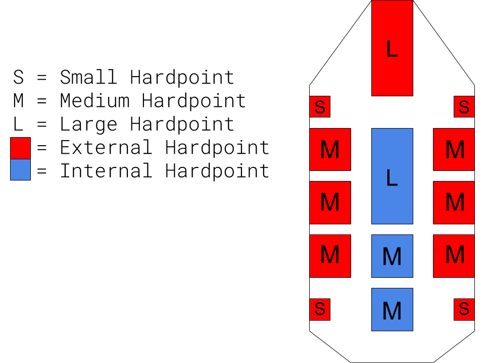

# Modular Combat Platform

> The Modular Combat Platform will be an all-in-one solution for creating 
> modular combat oriented objects in Unreal Engine that need to 
> literally be the sum of their parts. Developers will be equiped to specify 
> the stats of their creation with modular pieces, whether it be a spaceship 
> or a castle. It will support randomization and symmetry while being 
> highly extinsible for custom implementations.
---

### Requirements
The Modular Combat Platform is written in Unreal Engine 4 and depends upon it to function. 
No other libraries are needed

### How will it work?
###### The system will consist of two Actor Components to handle all of the heavy lifting: Hulls and Hardpoints.
- A Hull is a platform upon which hardpoints are placed. It handles the collection and 
implementation of it's hardpoint's stats
- A Hardpoint is a modular piece placed upon a Hull to alter its stats or add functionality.
External Hardpoints could be weapons, while internal Hardpoints might be ammo caches or
extra systems to increase turn rate.

###### Each hull will serve as a parent to keep track of its hardpoints as well as a central location from which to retrieve stats like:
- Speed
- Maneuverability
- Weight
- Health
- Damage
- Reload speed

###### These two Actor Components will be used as a springboard for developers in the creation of their own hulls and hardpoints, handling integration and framework so developers can focus on stats and gameplay.

---

### Implementation
The system at its core will be implemented with two C++ classes 
named `MCPHull` and `MCPHardpoint`, both of which will inherit 
from Actor Component, and a Data Asset called `MCPStats` to store stats.
Several example Hulls and Hardpoints will be provided as a starting point, 
but the real strength of this project is its extensibility.

Any new Hulls will inherit from `MCPHull`, just as any new Hardpoints will
inherit from `MCPHardpoint`. To specify stats of a new Hull - Hardpoint system,
developers will need to create a new DataAsset object of type `MCPStats` in their
project that will be shared between a hull and its hardpoints. As each stat block
is represented by a different DataAsset, an infinite number of Mobile Combat Platforms
may be used in a single game with different stats for each.