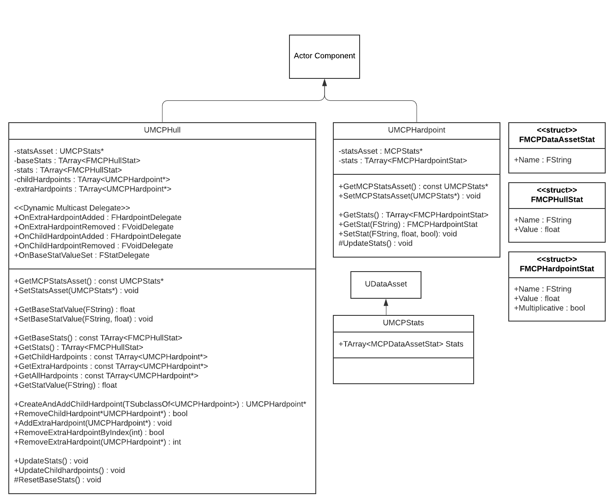

# Modular Combat Platform

### How to use



### Table of Contents
- [UMCPHull](#class-UMCPHull-UActorComponent)
- [UMCPHardpoint](#class-UMCPHardpoint-UActorComponent)
- [UMCPStats](#class-UMCPStats-UDataAsset)
- [FMCPDataAssetStat](#struct-FMCPDataAssetStat)
- [FMCPHullStat](#struct-FMCPHullStat)
- [FMCPHardpointStat](#struct-FMCPHardpointStat)

#### class UMCPHull : [UActorComponent](https://docs.unrealengine.com/4.27/en-US/API/Runtime/Engine/Components/UActorComponent/)
> The center point for this system.
> An MCPHull will automatically collect any MCPHardpoint components on the same actor, or in child actors
> and merge their stats into the MCPHull.
> An MCPHull also allows for extra hardpoints to be added from another Actor, as well as creating and
> adding child hardpoints at runtime.

Declares the following Dynamic Multicast Delegates:
```c++
DECLARE_DYNAMIC_MULTICAST_DELEGATE_OneParam(FHardpointDelegate, UMCPHardpoint*, hardpoint);
DECLARE_DYNAMIC_MULTICAST_DELEGATE(FVoidDelegate);
DECLARE_DYNAMIC_MULTICAST_DELEGATE_OneParam(FStatDelegate, FMCPHullStat, hullStat);
```

| Variable                                 | Use                                                                  |
|:-----------------------------------------|:---------------------------------------------------------------------|
| FHardpointDelegate OnExtraHardpointAdded | Broadcast when a hardpoint is added to the Extra Hardpoints List     |
| FVoidDelegate OnExtraHardpointRemoved    | Broadcast when a hardpoint is removed from the Extra Hardpoints List |
| FHardpointDelegate OnChildHardpointAdded | Broadcast when a hardpoint is added to the Child Hardpoints List     |
| FVoidDelegate OnChildHardpointRemoved    | Broadcast when a hardpoint is removed from the Child Hardpoints List |
| FStatDelegate OnBaseStatValueSet         | Broadcast when a base stat is set via SetBaseStatValue()             |
| UMCPStats* statsAsset                    | MCPStats data asset                                                  |
| TArray\<FMCPHullStat> baseStats          | Array of base stats from statsAsset                                  |
| TArray\<FMCPHullStat> stats              | Array of stats altered by hardpoints                                 |
| TArray<UMCPHardpoint*> childHardpoints   | Array of child hardpoints                                            |
| TArray<UMCPHardpoint*> extraHardpoints   | Array of any extra hardpoints added                                  |

| Function                                                                         | Use                                                                        |
|:---------------------------------------------------------------------------------|:---------------------------------------------------------------------------|
| **Public:**                                                                      |                                                                            |
| UMCPStats* GetMCPStatsAsset() const                                              | Getter for statsAsset                                                      |
| void SetStatsAsset(UMCPStats* asset)                                             | Setter for statsAsset                                                      |
| TArray\<FMCPHullStat> GetStats() const                                           | Getter for stats                                                           |
| TArray<UMCPHardpoint*> GetChildHardpoints() const                                | Getter for childHardpoints                                                 |
| TArray<UMCPHardpoint*> GetExtraHardpoints() const                                | Getter for extraHardpoints                                                 |
| TArray<UMCPHardpoint*> GetAllHardpoints() const                                  | Getter for all hardpoints                                                  |
| UMCPHardpoint* CreateAndAddChildHardpoint(TSubclassOf\<UMCPHardpoint> hardpoint) | Create and add a hardpoint to the childHarpdoints array                    |
| bool RemoveChildHardpoint(UMCPHardpoint* hardpoint)                              | Remove hardpoint from the childHardpoints array                            |
| void AddExtraHardpoint(UMCPHardpoint* hardpoint)                                 | Add a hardpoint to the extraHardpoints array                               |
| bool RemoveExtraHardpointByIndex(int index)                                      | Remove a hardpoint from the extraHardpoints array by index                 |
| int RemoveExtraHardpoint(UMCPHardpoint* hardpoint)                               | Remove a hardpoint from the extraHardpoints array by pointer               |
| float GetBaseStatValue(FString name) const                                       | Get base stat by name                                                      |
| void SetBaseStatValue(FString name, float value)                                 | Set a base stat's value                                                    |
| float GetStatValue(FString name) const                                           | Get stat by name                                                           |
| void UpdateStats()                                                               | Updates stats from baseStats                                               |
| void UpdateChildHardpoints()                                                     | Updates childHardpoints                                                    |
| **Protected:**                                                                   |                                                                            |
| void ResetBaseStats()                                                            | Reset baseStats back to what it should be from statsAsset with values of 0 |

#### class UMCPHardpoint : [UActorComponent](https://docs.unrealengine.com/4.27/en-US/API/Runtime/Engine/Components/UActorComponent/)
> The peripherals for this system.
> An MCPHardpoint stores stats as modifiers, and is used by an MCPHull to alter its base stats.
> MCPHardpoint stats are stored as a Name, Float, and a boolean for whether the stat should be
> additive or multiplicative when applied to an MCPHull's base stats.

| Variable                         | Use                                  |
|:---------------------------------|:-------------------------------------|
| UMCPStats* statsAsset            | MCPStats data asset                  |
| TArray\<FMCPHardpointStat> stats | Array of stats this hardpoint alters |

| Function                                                       | Use                   |
|:---------------------------------------------------------------|:----------------------|
| **Public:**                                                    |                       |
| UMCPStats* GetMCPStatsAsset() const                            | Getter for statsAsset |
| void SetMCPStatsAsset(UMCPStats* asset)                        | Setter for statsAsset |
| TArray\<FMCPHardpointStat> GetStats() const                    | Getter for stats      |
| FMCPHardpointStat GetStat(FString name)                        | Get stat by name      |
| void SetStat(FString name, float value, bool isMultiplicative) | Set stat by name      |
| **Protected:**                                                 |                       |
| void UpdateStats()                                             | Updates stats         |

#### class UMCPStats : [UDataAsset](https://docs.unrealengine.com/4.27/en-US/API/Runtime/Engine/Engine/UDataAsset/)
> Base class for the UDataAsset object every MCPHull and MCPHardpoint will need in its statsAsset variable.
> All Data Asset objects used in a Modular Combat Platform system should derive from this class.

| Variable                         | Use                                                    |
|:---------------------------------|:-------------------------------------------------------|
| TArray\<FMCPDataAssetStat> Stats | Stores the individual stats a combat platform will use |

#### struct FMCPDataAssetStat
> Used only by UMCPStats.

| Variable     | Use                          |
|:-------------|:-----------------------------|
| FString Name | Stores the name of this stat |

#### struct FMCPHullStat
> Struct representation of stats stored in an MCPHull.

| Variable     | Use                          |
|:-------------|:-----------------------------|
| FString Name | Stores the name of this stat |
| float Value  | This stat's value            |

#### struct FMCPHardpointStat
> Struct representation of stats stored in an MCPHardpoint.

| Variable              | Use                                                              |
|:----------------------|:-----------------------------------------------------------------|
| FString Name          | Stores the name of this stat                                     |
| float Value           | This stat's value                                                |
| bool IsMultiplicative | Should this stat be added or multiplied into a Hull's base stats |